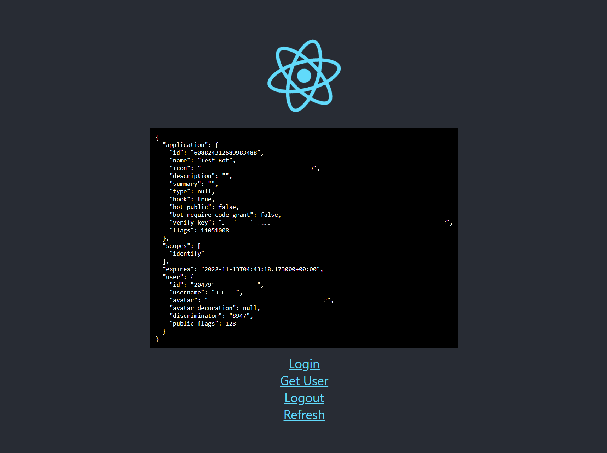

# Netlify React App with Discord Oauth2

This is an example project that uses the Netlify serverless functions and discord oauth2. Examples for login, logout, refresh, and get logged in user have been added.

## How to run this locally

This should be very easy to get set up on your own thanks to Netlify CLI.

The only set up needed will be to create an `.env` file based on the `.env.example` file with your own Client ID and Client Secret. [Found Here](https://discord.com/developers/applications/) in the Oauth2 tab of an application.

1) We need to install netlify cli with `npm install -g netlify-cli`
2) Run `netlify dev`
3) Visit http://localhost:8888

